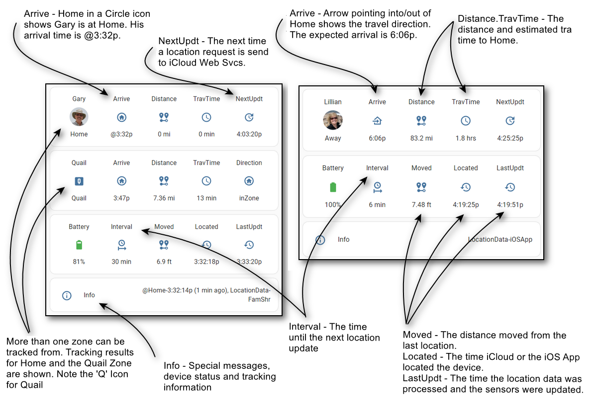

## Overview of the Tracking Results screen

The iCloud3 Custom Component provides the core device tracking service. It does the following:

  - Initializes and sets up all tracking activities using the device configuration data from the iCloud account.
  - Monitors the iOS App device_tracker entity for location changes, zone enter/exit triggers and battery information.
  - Requests and processes location data from iCloud Location Services and the iOS App.
  - Analyzes the location data and tracks the devices.
  - Updates the sensors associated with each device.

> The iCloud3 files are installed in the *config/custom_components/icloud3* directory on your HA server.


The example screens below show examples of a tracked device's current status. The following is displayed:

- Gary, on the left, is at Home. Lillian, on the Right is Away.
  - Arrive item - The icons and text show Gary is at Home (Home icon in a circle and he arrived home at @3:22p. Lillian is traveling towards home. The Home d at the Home he arrival time. Notice the distance, travel time and travel direction from the Home Zone. 
- Notice when the device was last located by iCloud or the iOS App, when it was last updated by iCloud3 and the time of the next update. 
- Gary is tracking from Home and the Quail Zone, Lillian just from Home.
- The *Info* field shows tracking results from nearby devices is being used.





Note: The Lovelace code for these screens is in [Step #5 - Set up a Lovelace card tracking card](.../2.0-installing-and-configuring?id=step-6-set-up-a-lovelace-card-tracking-card) 


## Creating the Tracking Results screen (Lovelace yaml Code)


Generally, you will create a Lovelace grid card and copy the raw yaml statements below o that card.  to your phone in the yaml code.

!> The *Event Log card* is a Lovelace custom card. In order to set it up, it must be added to the Lovelace Resources. iCloud3 automatically adds it to the Lovelace Resources when it starts so nothing should need to be done.  Manual instructions on doing this are at the end of this chapter in case it is not added correctly or an error occurs.

Do the following:
1. Select **'⋮' (Upper right corner) > Edit Dashboard** as you normally do to create or update a Lovelace card. The *Take control of your dashboard* screen is displayed.
   - Select **Start with an empty dashboard**
   - Select **Take Control**

   A blank *Edit Dashboard* screen is displayed
2. Select **'⋮' (Upper right corner) > Raw configuration editor** and a blank *Edit Configuration* is displayed. Ignore the **+  Add Card**. 
3. Copy all of the code in the above code block and past it into the Edit Configuration window. 
   - **Erase the following code** that HA adds to the beginning of the Lovelace yaml code editor:	
   ```
   views:
     - title: Home
   ```

   - **Copy the following code** below into the blank editor area. This code is for the *gary_iphone* device_tracker entity on the left-side of the screen above.. Change all occurrences of *gary_iphone* to the iCloud3 device_tracker entity name for your phone you entered in the *Add Devices*  screen in step 3.3 above.
    ```yaml
    title: iCloud3
    views:
      - title: iCloud3
        cards:
          - square: false
            columns: 1
            type: grid
            cards:
              - type: glance
                state_color: true
                show_name: true
                show_icon: true
                show_state: true
                columns: 5
                entities:
                  - entity: device_tracker.gary_iphone
                    name: Gary
                  - entity: sensor.gary_iphone_arrival_time
                    name: Arrive
                  - entity: sensor.gary_iphone_zone_distance
                    name: Distance
                  - entity: sensor.gary_iphone_travel_time
                    name: TravTime
                  - entity: sensor.gary_iphone_next_update
                    name: NextUpdt
             - type: glance
               columns: 5
               entities:
                 - entity: sensor.gary_iphone_battery
                   name: Battery
                 - entity: sensor.gary_iphone_interval
                   name: Interval
                 - entity: sensor.gary_iphone_moved_distance
                   name: Moved
                 - entity: sensor.gary_iphone_last_located
                   name: Located
                 - entity: sensor.gary_iphone_last_update
                   name: LastUpdt
              - type: entities
                entities:
                  - entity: sensor.gary_iphone_info
                    name: Info - Gary
                    icon: mdi:information-outline
   
          - type: grid
            square: false
            columns: 1
            cards:
              - type: custom:icloud3-event-log-card
    ```

​	4. Select **Save**, then select the '**X**' next to Edit Configuration in the upper-left, then select **Done**.

