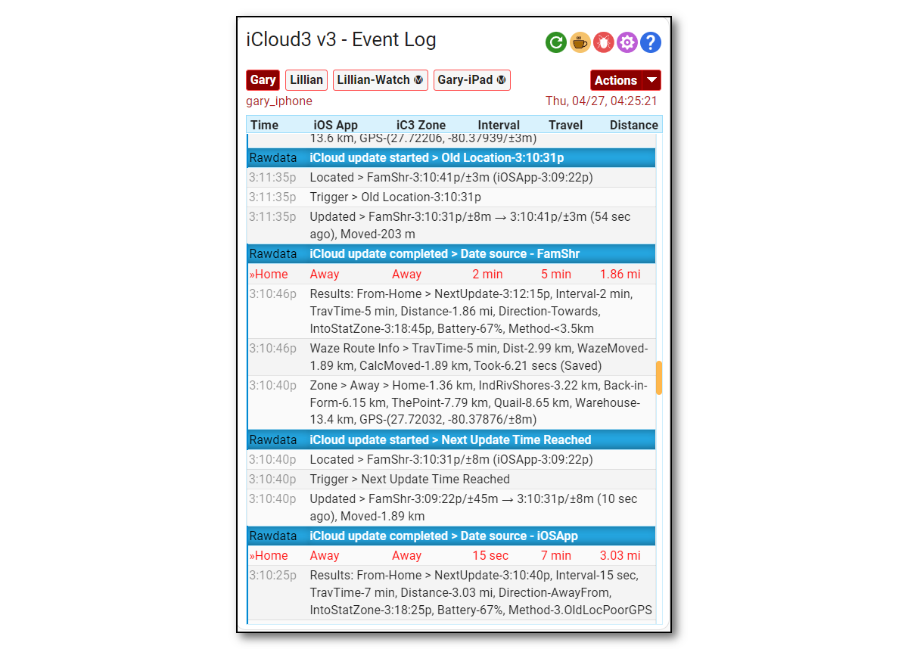

### 1.2.2 Creating the Event Log screen

The Event Log shows the status of iCloud3 operations. It displays a lot of information on how iCloud3 starts and on provides the tracking events for all of the devices being tracked and monitored. For this custom card to be displayed, it needs to be added to the Lovelace Resources. 

The Event Log is a custom card and HA looks for it in the /www directory. 

- When iCloud3 was installed, the *icloud3-event-log-card.js* file was copied from the *icloud3/event_log_card* directory to the */www/icloud3* directory (or another custom_card directory you might have set up for iCloud3 v2).

-  When iCloud3 starts, it does the following:
  - Determine if the Event Log in the */www/icloud3* directory is the latest version. If not, it is updated. A browser refresh will be needed it it was updated. A notification is displayed on each device that a refresh is needed. 

    Note: The notification will not be displayed when it is first installed, it is only displayed on an update.

  - Determine if the Lovelace Resource list contains the Event Log and if the directory is correct. It will be added or updated if that is needed.

When you created the Lovelace card above, you added the statements for the Event Log. They are after all of the other statements.

       - type: grid
         square: false
         columns: 1
         cards:
           - type: custom:icloud3-event-log-card

Hopefully, the Event Log displayed correctly. If it did not display and *Custom element doesn't exist icloud3-event-log-card* error message displayed instead, the Event Log needs to be added to the Lovelace Resources.

