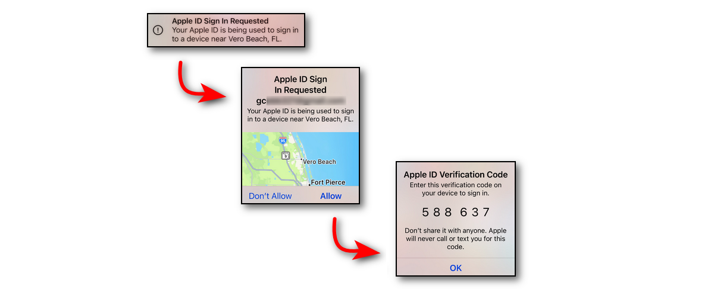
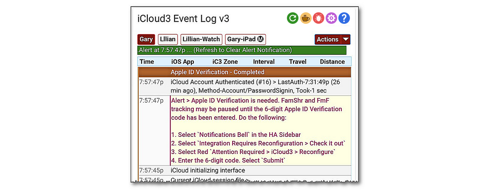
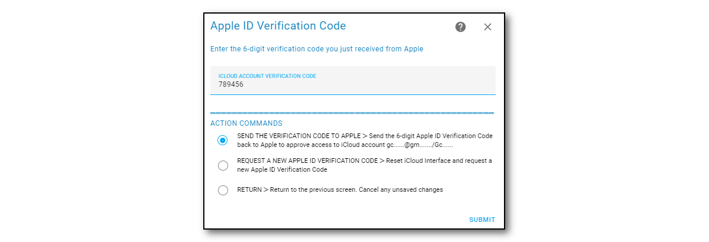

# Authenticating Apple iCloud Account Access

------

### Apple Notification windows

iCloud3 will log into your Apple iCloud account to retrieve information related to the devices in your Family Sharing list to include:

- Device name, type, model and other identifying information, etc.
- Location data, gps accuracy, location time, etc.

When iCloud3 logs in the first time and about every 2-3 months after that, Apple will display the authentication screens on your iPhones, or iPads with the 6-digit verification code. 

The *Event Log* screen also displays an alert that the Verification Code has been requested from Apple.

### Apple ID Verification Code

When you receive this notification, the 6-digit Apple ID Verification Code is entered on the *Configure Settings > Enter/Request Apple ID Verification Code* screen. 

- Enter the 6-digit code, Select Send the Verification Code to Apple and select Submit. The code will be sent to Apple,  Apple will verify it and a message indicating it has been accepted is displayed on the screen. 

If it was not accepted, an error message is displayed. Do one of the following:

- Enter the correct number and resubmit it.
- The code Apple sent is only valid for a short time. If you were away, the time has expired, you lost the code or can not remember it, select Request a New Apple ID Verification Code and select Submit. A new code will be sent to your iPhone or iPad.

There are several ways to display this screen:

- From the iCloud3 Configure Settings menu screen
- From the iCloud Account & iOS App screen
- From the* Home Assistant Notifications Bell on the Home Assistant dashboard (shown below)
- From the Home Assistant Devices & Settings screen 

  

  

### Access tokens, password and security

iCloud3 is always logged into your Apple account. When iCloud3 starts and logs into your iCloud account, Apple returns an *access token* indicating iCloud3 is authorized to use data from the iCloud account. These tokens expire after about 30-minutes and the login process using the access token is done again. After a while (determined by Apple), the token is invalidated and the Apple requests the password. A new access token is sent and the process starts over.

### Login email Notification from Apple

An email is sent from Apple when you log into your your iCloud account using your password. You will receive this email:

- When you are setting up iCloud3 and you login the first time
- Every time the password is used to log into your account. This may be several times or more during the day.

!> You will receive a number of these emails from Apple each day while iCloud3 is tracking your devices. The number you receive is determined by Apple, iCloud3 can not do anything about this.  iCloud3 minimizes the number you receive as best it can by using tokens first and only logging in when Apple requests one.

#### What can you do to minimize these emails from clogging up your inbox

The short answer is not much. 

I have set up a gmail filter that detects the email from Apple, marks it as read, bypasses the inbox and puts it in a special Apple eMail folder. Some have said they are concerned about someone hacking into their Apple account, they will not know about it and do not want to use these automatic filters. A valid concern but this works for me. I would welcome any other suggestions I might add to this User Guide to help others deal with this problem.
