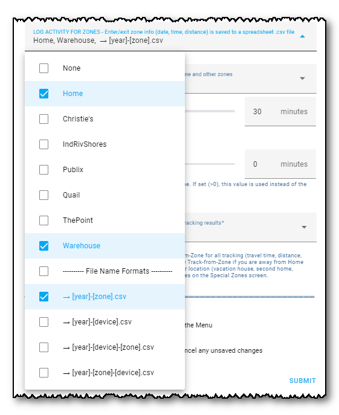
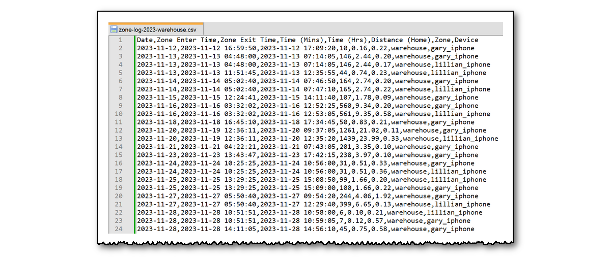
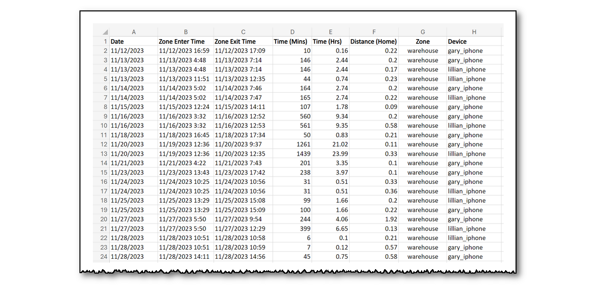
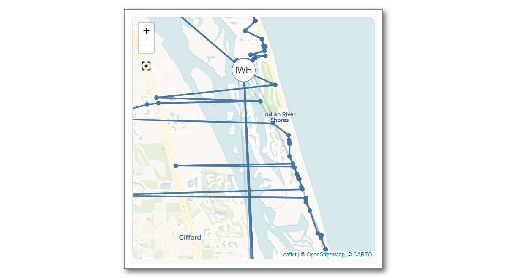
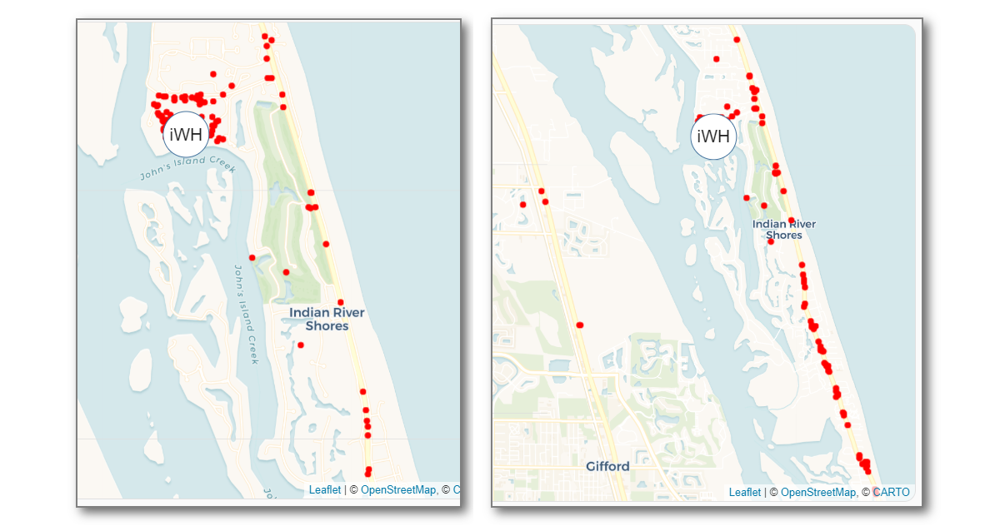

# Other Features


------

## Tracking From More Than One Zone

Normally, you track a device from the Home Zone. The sensor entities for travel time, distance, intervals, next update time, etc. are calculated for the Home Zone. iCloud3 also lets you track a device from another zone. It will calculate the same type of sensor entities for that zone. 

To track from another zone, select that zone in the *Track from Zones* parameter on the *Update Tracked iCloud3 Device* screen. 

1. Select the *iCloud3 Devices* screen.
2. Select the device to be tracked from the other zone.
3. Select the *Track-from-Zones* field, then select the zones to be tracked from.


New sensors are created for all of the track-from-zones.

- **Sensor Entities** - The zone name is added to the end of the entity name. For example:
  - Home Zone -*sensor.gary_iphone_travel_time_**home**, sensor.gary_iphone_zone_distance_**home***, etc.
  - Warehouse Zone - *sensor.gary_iphone_travel_time_**warehouse***, *sensor.gary_iphone_zone_distance_**warehouse***, etc.

- **Sensor's Friendly Name** - The zone's display-as friendly is added to the end of the sensor friendly name:
  - Home Zone - Gary TravelTime (**Home**), Gary ZoneDistance (**Home**), etc.
  - Warehouse Zone - Gary TravelTime (**Warehouse**), Gary ZoneDistance (**Warehouse**), etc.


The sensors created when only tracking from the Home zone (*sensor.gary_iphone_travel_time, sensor.gary_iphone_zone_distance, etc.*) have changed:

- Closer to the Home zone - Show the Home zone information
- Within 8km of the Other zone and going towards it - Show the Other zone's information
- Within 8km of the Other zone and going away from it - Show the Home zone's information
- Going towards both zones - Show the Home zone's information if more than 8km away from the Other zone
- Other zone's information is displayed - It's first initial is displayed in the *distance* sensor (🅦 is shown for the Warehouse zone).


------

## Log Zone Activity for Expense Reports or Zone Tracking

There may be times when you want to keep track of when a device enters and exits a zone. This is useful for:

- **Expense Reporting** - Keep track of the times you are at a specific location when the miles driven are reimbursable.
- **Tax deductions** - Keep track of the times you visit client locations when the miles driven are deductible on your taxes. 
- **Zone Logging** - Keep track of when a person(s) visit a location or multiple locations.

To do this:

1. Set an HA Zone for the location on the *HA Settings > Areas & Zones > Zones* screen. 

2. Add the zones to be tracked in the *Log Activity for Zones* parameter on the *Update Devices* screen for every device you want to track. You can log more than one zone at the same time.

   

3. The file name lets you select the way the data should be organized. The name contains the year, zone and devicename and is shown below. Select the one that best fits your situation:

   1. **By Zone** -`[year]-[zone].csv` - This lets you log multiple devices for the same zone. A record for every device is added to the same Zone file so you can see all of the Devices that were at a specific Zone.
   2. **By Device** -`[year]-[device].csv`  - This lets you log multiple zones for the same device. A record for every zone is added to the same Device file so you can see all of the Zones that were visited by a specific Device.
   3. **By Device-Zone** -`[year]-[device]-[zone].csv`  - A Device's activity is logged to a separate Zone file.
   4. **By Zone-Device** -`[year]-[zone]-[device].csv`  - Every Zone has a separate file for every Device.

A *.csv* spreadsheet file is created in the */config* directory on your Home Assistant server. It is updated when the device leaves the zone with the following information:

- Date
- Date and time the zone was entered
- Date and time the zone was exited from
- Time in the zone (minutes and hours)
- Distance from the Home zone
- Zone name
- Device entity name



Importing this file into Excel provides various ways of sorting and summarizing this data.




------

## Display the Waze History Locations on a Map Card

Use the *sensor.icloud3_wazehist_track* sensor entity as the source of a Lovelace map card to see the locations of all of the 11m locations points that have been saved. 

Create a Lovelace map card:


Or copy the yaml code below into the *Show Code Editor* yaml code field on a new Lovelace card.

```type:yaml
type: map
entities:
  - entity: sensor.icloud3_wazehist_track
title: WazeHistory GPS
hours_to_show: 24
dark_mode: false
```

After the location data has been loaded into the sensor, the resulting map card looks similar to the map below. 



> This really does not have any practical use but it was a fun project to see how many locations had been saved.

Each of the dots on the map is a saved location. Unfortunately, Home Assistant treats the locations on the map card as a tracking point and draws a line between the points in the order they were loaded. Ignore the lines.

To try to display the points in a logical order based on your most frequent driving direction, select *North-South* or *East-West* in the *Waze Location Map Display* field on the *Waze - History Database* parameter screen.


### How to Remove the Lines Between the Locations  {docsify-ignore}

The lines between the locations dots can be removed using the *card-mod* Lovelace custom style developed by Thomas Loven. With *card-mod*, custom CSS styles can be applied to various elements of the Home Assistant frontend (element colors, icons, borders, etc.). Information about *card_mod* can be found [here](https://github.com/thomasloven/lovelace-card-mod/blob/master/README.md).

> Using this custom style, the North-South and East-West track direction is irreverent since the lines between the locations is not displayed.

The installation is described in the *card-mod* documentation and below.

1. Install *card_mod* with Hacs. (Hacs > Frontend > Search for *card-mod* > Lovelace > Download)
2. Add the following to your `configuration.yaml` file and restart Home Assistant.

   ```
   frontend:
     extra_module_url:
       /community/lovelace-card-mod/card-mod.js
   ```

   Change the path if you have moved the *card-mod.js* file to another location. The *card_mod* documentation show it being installed in *hacsfiles* but if you installed through HACS, it is probably in the *www/community/lovelace-card-mod/* directory. 

3. Edit the Lovelace map card configuration parameters described above and add the following to it. 

   ```type:yaml
   card_mod:
     style:
       ha-map$:
         .leaflet-pane: |
           path {
             fill: red;
             stroke: none;
           }
         .leaflet-overlay-pane: |
           path {
             fill: red;
             stroke: none;
           }
   ```


After the location data has been loaded into the sensor, the map card now looks like this.




### Loading the saved locations  {docsify-ignore}

The saved locations are loaded into the *sensor.icloud3_wazehist_track* sensor entity several ways.

- Each night at midnight.
- Immediately by selecting *Event Log > Actions > WazeHist - Load track locations for map*
- Immediately by selecting *iCloud3 Configurator > Actions > Waze Hist Map Track - Load route locations for map display*

